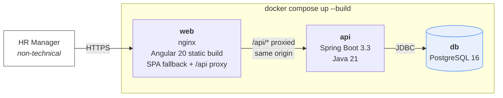
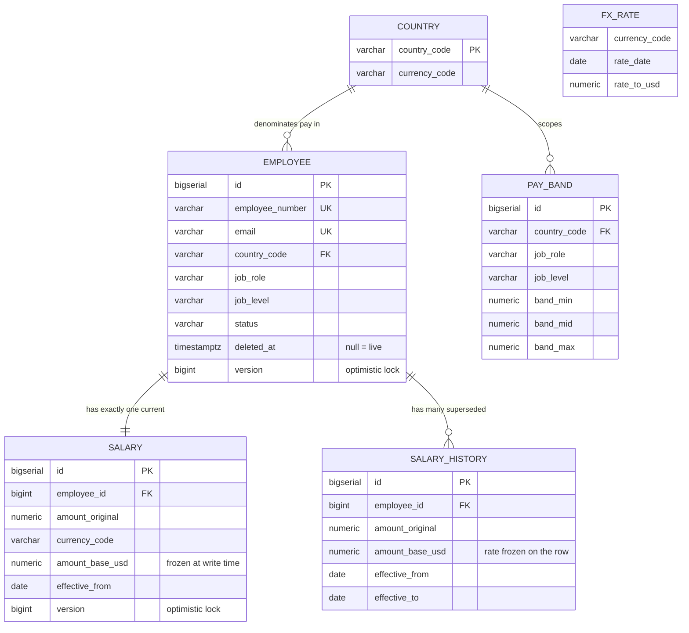
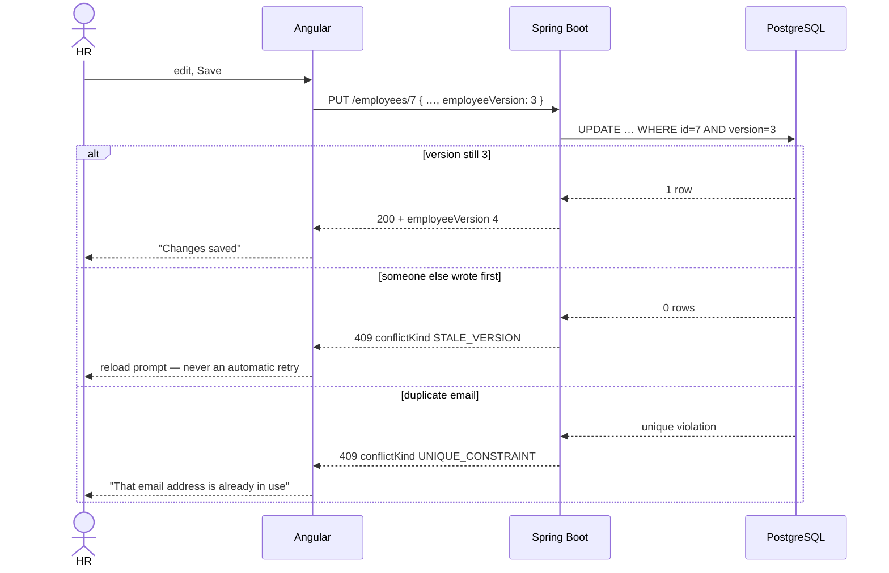
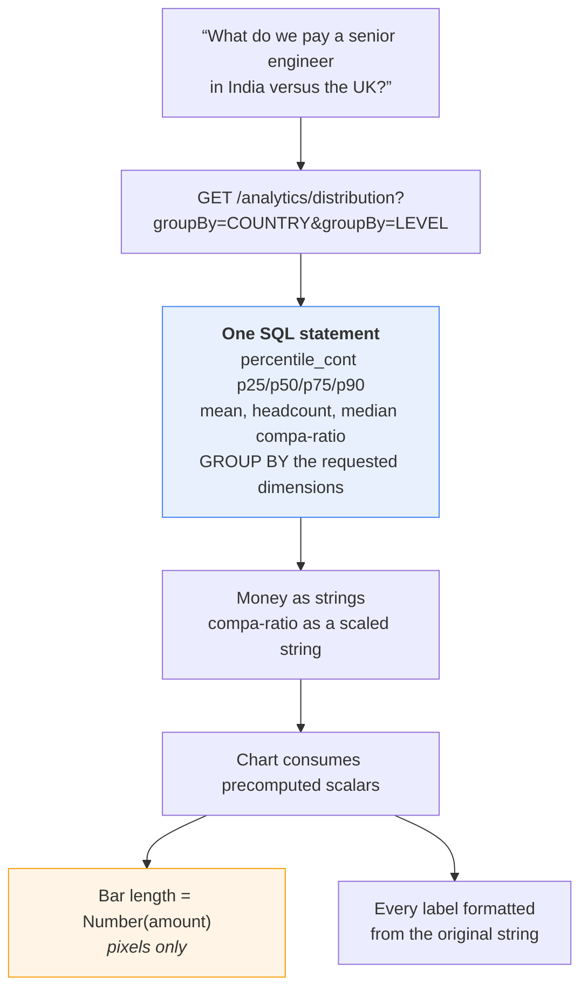
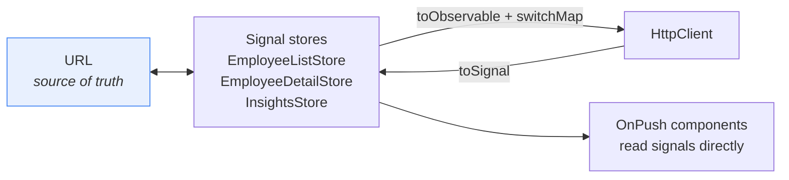

# Payscope — architecture

Diagrams use Mermaid, which GitHub renders inline. The decisions behind them live in
[`docs/adr/`](adr/); this document shows the shapes, and links to the reasoning rather than
repeating it.

---

## 1. Containers

The browser only ever talks to one origin. `proxy.conf.json` handles this in development; nginx
handles it in the composed stack. They are separate mechanisms for the same property, which is
why the composed path has to be verified separately — a dev-mode check will not catch a broken
production proxy.

The database publishes **no host port**. `api` reaches it by service name, and publishing 5432
made `docker compose up` fail on any machine already running PostgreSQL.

---

## 2. Data model

Four decisions are visible in that shape:

- **`amount_base_usd` is stored, not computed on read** — the rate is frozen on the row at write
  time, so a historical figure never moves when rates change ([ADR-0001](adr/0001-usd-base-currency-converted-at-write-time.md)).
- **Current salary and history are separate tables.** One current row per employee keeps every
  analytics query free of "latest row per group" gymnastics; history is append-only
  ([ADR-0004](adr/0004-current-salary-table-with-separate-history.md)).
- **`deleted_at` is distinct from `status`.** Deactivated is an employment fact; deleted is a
  record fact. Unique indexes are partial (`WHERE deleted_at IS NULL`) so a deleted employee's
  email can be reused ([ADR-0005](adr/0005-soft-delete-distinct-from-employment-status.md)).
- **Pay bands are keyed `(role, level, country)` in local currency**, which makes compa-ratio
  dimensionless and FX-free — the one figure that compares fairly across countries
  ([ADR-0002](adr/0002-pay-bands-per-role-level-country.md)).

---

## 3. The write path, and why a 409 is never retried

**Both branches are 409 and they need opposite treatment.** Retrying a stale version with a fresh
token re-creates exactly the lost update the version exists to prevent; a uniqueness violation
just needs its message shown. The client could not originally tell them apart, so a duplicate
email produced no feedback at all — the server now labels each with `conflictKind`
([ADR-0007](adr/0007-optimistic-locking-as-concurrency-and-idempotency-mechanism.md)).

`employeeVersion` and `salaryVersion` are separate tokens and never interchangeable. Deactivate
sends **no** version — it is a transition to a fixed target state, not a read-modify-write, so
there is no lost update to guard against.

---

## 4. The analytical path — all aggregation in SQL

**No statistic is ever computed in the browser** ([ADR-0006](adr/0006-ngx-charts-fed-precomputed-aggregates.md)).
Percentiles use `percentile_cont`, which PostgreSQL defines only over `double precision` — a
deliberate, bounded exception to the money rule, recorded rather than hidden
([ADR-0003](adr/0003-percentile-cont-for-all-percentiles.md),
[ADR-0008](adr/0008-accepting-a-double-precision-step-inside-percentile-cont.md)).

The single amber box is the only place a money amount becomes a number: an SVG bar's length must
be numeric. It drives geometry and never a label, and a test asserts that.

---

## 5. Client state

State lives in signals; **RxJS appears only at the HTTP boundary, where cancellation does real
work.** Typing "John" quickly can let the response for "Jo" resolve last and repaint the table
with results the user has already left — `switchMap` closes that.

Four such races were found and fixed during the build: the list search, the detail load, the
salary-history fetch, and a late *write* response repainting a different employee's page. The
write case takes the opposite remedy: the request is **not** cancelled, because the server has
already applied it — only the state update is guarded, on the still-active employee id.

The app runs **zoneless**, verified by rendering rather than assumed
([ADR-0009](adr/0009-zoneless-angular.md)).
